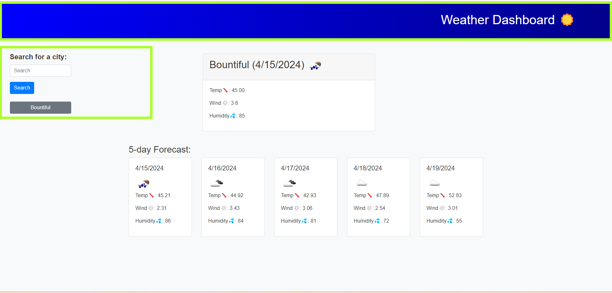

# Weather-Dashboard
Making a to-do task list with this site is easier than ever with our new layout.

## Description
A weather service that you can use that will provide you with the latest updates on the weather near you! You can even search for the status of weather that is far away.

## Badges
Shields.io

## Visuals
Link: <a href="https://bwater47.github.io/Weather-Accurate/" alt="live site link">Live Link</a>

## Installation
N/A

## Usage
You can use this site to search for weather near you using a google api.

## Support
You can contact support through email by emailing brennw47@gmail.com.

## Roadmap
N/A

## Contributing
Contributing is allowed if you're in the U of U Coding Bootcamp. Contact me on the slack channel for information.

## Authors and acknowledgment
Bootcamp Spot. (04/11/2024). https://bootcampspot.com/

W3Schools Online Web Tutorials. (04/11/2024). https://www.w3schools.com/ 

Chatgpt. ChatGPT. (04/11/2024). https://openai.com/chatgpt

• Please note: While ChatGPT was utilized to generate dialog content for the README file, it was not involved in the generation of any code, HTML edits, CSS edits, or other assets within the repository apart from this README specifically.

• All other sources, links, and information utilized within the project were obtained from the provided sources mentioned in this paragraph. This includes class materials, modules, TA guidance, instructor-provided resources, as well as communication through platforms such as Slack or Discord. Additionally, numerous links and resources were provided within the assignment instructions and demonstrated during class sessions.

## Project status
N/A