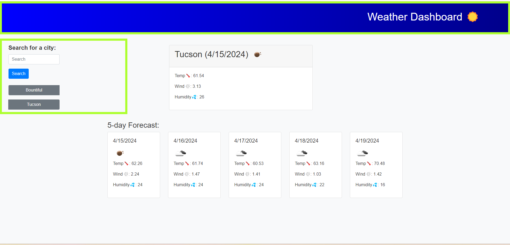

# Weather-Accurate
Searching for the weather forecast hasn't been this easy before. You can now see a full five day forecast so you can plan your trips accordingly.

## Description
Welcome to WeatherAccurate, your ultimate weather companion for staying informed and prepared, no matter where your adventures take you. With WeatherAccurate, you have instant access to the latest weather updates for your current location and any destination around the globe. Say goodbye to unexpected weather surprises and hello to hassle-free planning!

Plan your day, week, or even your next vacation with confidence using WeatherAccurate's comprehensive five-day forecast feature. Whether you're exploring local attractions or embarking on a journey to far-off lands, WeatherAccurate ensures you're always one step ahead of the elements. Don't let weather uncertainty hold you back – embrace the freedom of informed decision-making with WeatherAccurate today!

## Badges
Shields.io

## Visuals
Link: <a href="https://bwater47.github.io/Weather-Accurate/" alt="live site link">Live Link</a>

## Installation
N/A

## Usage
Current Weather: Get real-time updates on the current weather conditions for any location.

Five Day Forecast: Plan your trips effectively with a full five-day forecast, including temperature, wind speed, and humidity.

Search Functionality: Easily search for the weather forecast of any location, whether it's your hometown or a destination halfway around the world.

User-friendly Interface: WeatherAccurate features a simple and intuitive interface, making it easy for anyone to use.

## Support
You can contact support through email by emailing brennw47@gmail.com.

## Roadmap
N/A

## Contributing
Contributing is allowed if you're in the U of U Coding Bootcamp. Contact me on the slack channel for information.

## Authors and acknowledgment
Bootcamp Spot. (04/11/2024). https://bootcampspot.com/

W3Schools Online Web Tutorials. (04/11/2024). https://www.w3schools.com/ 

Chatgpt. ChatGPT. (04/11/2024). https://openai.com/chatgpt

• Please note: While ChatGPT was utilized to generate dialog content for the README file, it was not involved in the generation of any code, HTML edits, CSS edits, or other assets within the repository apart from this README specifically.

• All other sources, links, and information utilized within the project were obtained from the provided sources mentioned in this paragraph. This includes class materials, modules, TA guidance, instructor-provided resources, as well as communication through platforms such as Slack or Discord. Additionally, numerous links and resources were provided within the assignment instructions and demonstrated during class sessions.

## Project status
N/A